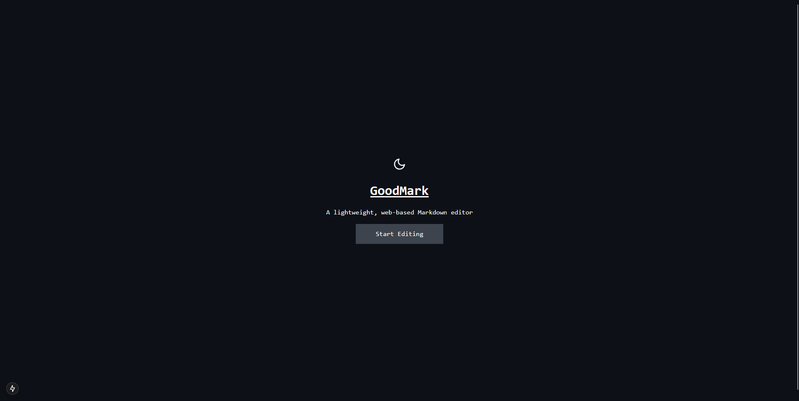
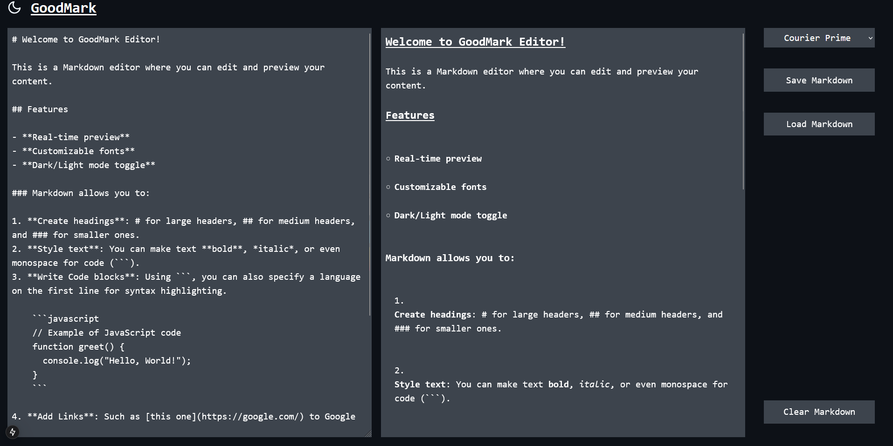

# GoodMark

A simple web-tool to preview and edit markdown.

## Project Summary

The purpose for this project is to create an easy to use lightweight Markdown previewing tool. This will allow users to edit and preview Markdown syntax in real-time, aiding those unfamiliar with markdown in proper use, and helping those familiar with markdown get the most out of it. The tool will simply the Markdown working process to ensure that it is accessible for all.

### Project Description

GoodMark is a web-based application designed to simplify the Markdown writing process by transforming plain-text Markdown into rendered HTML in real-time. It will be a good utility for both those who want to experiment with how they might use Markdown and seasoned Markdown users hoping to use a light-weight Markdown tool that renders in real time without needing a full editor installed.

Key features:
1. A real-time preview that dynamically updates as users type Markdown.
2. Syntax highlighting in code snippets.
3. A clean simple User Interface, see [User Interface Design](#user-interface) for more details.
4. Both dark and light mode to suit your preferences.

## Design

There are several stages to designing what this project will look like and how the project will be built. In order to gain a vision of what I am creating I started with the User Interface design. I then went on to design the architecture of the Software and designed how I will go about implementing the Software.

### User Interface

The user interface design was created in Figma. The prototype for this design is available [here](https://www.figma.com/proto/Bkpb34iogKXZpO8ttmP5ef/GoodMark?node-id=1-5&p=f&t=YSk4zt3abM4z9aqy-1&scaling=contain&content-scaling=fixed&page-id=0%3A1&starting-point-node-id=1%3A5&show-proto-sidebar=1).

#### Product Design

##### GoodMark Welcome Screen

When the user first opens the website, they should be greeted with a splash screen that will give them a brief overview of what the product is. This is similar to how many applications design their software. We see this significantly in video game design, where you would typically be presented with a game menu before being placed into the game. I felt that this was a good approach for this project as it would not overwhelm newer users with an immediate editing screen, and make them feel that they have a choice before entering the editor. I plan to use a cookie on the user's browser to track if they have visited the site and pressed the "Start Editing" button before, if they have, they will not be presented with the screen again unless they clear their cookies; this will avoid regular users having to continuously press the "Start Editing" button, whilst still giving newer users this choice splash screen. The user will also be able to select whether they wish to use light or dark mode on this screen, this will similarly be saved into a cookie on their browser - dark mode will be the default.

##### Editor Screen

Once the user selects the "Start Editing" button, or if they have visited the website before and have the cookie stored in their browser, they will be taken to the main Markdown editing screen. This screen will initially have some sample text if they have not edited before, if they have edited before, the last text they wrote will be populated into the textbox, similarly, stored in a cookie. The sample text will feature a heading, some normal text, and a code block to give the user an idea of the different Markdown options available to them. They will also have several options including a combo-box which will allow them to select a font from a pre-defined list, a "Save Markdown" button, allowing them to save a file to their machine containing their Markdown, and a "Load Markdown" button, allowing them to load any Markdown file from their machine into the text box. In the bottom right, there is a "Clear Markdown" button, this will allow the user to quickly clear their Markdown currently present, however, to avoid any accidental data losses it will prompt for confirmation first. Similarly to the welcome screen, they can also select light or dark mode on this screen with the icon in the top left.

###### Dark Mode

###### Light Mode

##### Colour Scheme

Perhaps the most widely distributed use of Markdown on the internet is on GitHub, as such, I felt that using [GitHub's colour scheme](https://primer.style/foundations/color/base-scales) would be appropriate to allow the user to preview the Markdown in the context that it will likely be distributed, in the form of a README similar to this file. I also feel that GitHub's neutral colour scheme is appropriate for this project as it will not be overstimulating whilst the user is attempting to write their Markdown. Bright flashy colours may distract the user. I also decided that dark mode would be the best as our default colour scheme as it avoids any accidental issues with bright light, for example, if someone's eyes were adjusted to the dark, a bright light will ruin that adjustment, whereas, if someone's eyes are adjusted for the light, a dark screen will minimally change that, if at all.

#### Accessibility

As discussed above, GitHub's colour scheme will have already been tested for accessibility, however, I ran some basic colour blindness simulations, using [Coblis](https://www.color-blindness.com/coblis-color-blindness-simulator/) to ensure that the UI was appropriate for users with colour blindness, the results of these are available [here](assets/readme-images/colour-blindness-simulations). Other important accessibility considerations that will be required in the implementation are keyboard navigation, to ensure that individuals navigating without a mouse can easily navigate the tool, this will primarily involve ensuring that the "Start Editing" button can be pressed without a mouse, and that the font selection, "Load Markdown" and "Save Markdown", and "Clear Markdown" buttons can be pressed, and that the user can easily return to the editor box. Further important accessibility testing will be to ensure that screen readers are able to correctly read the markdown editing box. Due to the scope and resourcing of this project, languages will not be accounted for, however, this would typically be an important accessibility consideration for a project - in this case, the site will be available in English only. We should also consider individuals devices, as such, responsive design will be important; editing Markdown on a phone is not ideal, but we should allow a user to do this if we wish and scale the page as appropriate, similarly, we need to account for both large and small desktop monitors to ensure that users in all ranges can use the site. There will be no animations on this site, as such, there is no need to consider this, however, we will add a timeout to the dark mode and light mode switcher to avoid any accidental mass-activations which could trigger photosensitivity.

### Software

This is an initial view of the design of the software.

### Architecture

The software will have a frontend, built in React, this will implement a responsive user interface. It will then feature a backend which will be hosted to handle the Markdown-to-HTML rendering, this will allow us to adopt a server-side processing approach. Server-side processing is appropriate as this project is at a small scale, as such, we will not be overly concerned with servers being overwhelmed.

#### Backend Architecture

The backend will be implemented with Node.js, and will feature two main endpoints:
- GET `/render` - this will convert Markdown to HTML
- GET `/fonts` - this will return a list of available fonts to the user

#### Frontend Architecture

The frontend will be implemented with React, and will feature these main components:
- Welcome Page:
  - An icon for light and dark mode
  - A text area for title and description
  - A button for the "Start Editing" button
- Editing Screen:
   - A text area where the user will input the Markdown and it is converted to HTML
   - A header to contain the title and light and dark mode selector
   - A sidebar to contain the font selector, and control buttons
   - Several buttons within the sidebar for controls

### Implementation Approach

In order to ensure the program is robust a Test-Driven Development approach will be taken. This will require that before adding a feature, a test is written to test the feature, and then the feature is implemented to make the test pass. In order to test the frontend we will use Jest's React Testing Library to perform component-level testing to ensure that all components are implemented as designed. In order to ensure that the backend functions correctly, integration unit tests will be written to test each endpoint and its function, any externals will be mocked to ensure that our code is being tested. In order to supplement this implementation approach, we will use GitHub Actions to implement a CI/CD pipeline that ensures that the project builds, that all tests pass, and that the code is linted in the correct format, before a PR can be merged. We will also use the pipeline to deliver any changes from a PR to the live software once merged.

## Planning

In order to create a well-rounded project I want to work using an Agile approach utilising sprints in order to deliver the solution in stages. In order to assist my development of the solution, I will use several tools, the details of these are below.

### Personas and User Stories

The first tool I plan to use in order to guide my development is the use of user stories. Firstly, in a set of high-level stories that outline the main overall requirements of the project, and then with each feature having its own, more specific user story. To further aid this, I have also created three personas who will each have their own goals and struggles, and I have created empathy maps of each of these, when a feature is being developed, I will specify which persona(s) it is for.

#### Personas

##### Developer Dave

Developer Dave is a Junior Developer aged 20.

###### Goals:
1. To be able to quickly view Markdown documentation such as README files.
2. To be able to modify and save reusable Markdown content to share it with his team.
3. To gain a greater understanding of Markdown and how it can be used for writing.

###### Frustrations:
1. He regularly works with tools that have no previews, this means that any syntax mistakes aren't noticed until the Markdown is built.
2. His current employer supported Markdown tool only has light mode available.

###### Empathy Map:

Dave Says:
- "I need to notice errors in my Markdown before it is too late"
- "Light mode strains my eyes, I need a dark mode option"
- "I'd like to learn more about Markdown whilst using it"

Dave Thinks:
- "How can I avoid wasting time fixing Markdown that is already built?"
- "Is there a tool that makes working with Markdown visually enjoyable?"

Dave Feels:
- Frustration that he cannot use a tool with live previews.
- Annoyance that the tools available do not offer dark mode.
- Curiosity about how he can utilise Markdown more.

Dave Does:
- Writes README and documentation files in Markdown.
- Builds Markdown without a live preview, resulting in syntax issues.
- Seeks tools with dark modes available.

##### Writer Wendy

Writer Wendy is an experienced Content Developer aged 35.

###### Goals:
1. To be able to edit documentation in Markdown in a more lightweight environment.
2. To be able to view a live preview as she writes new Markdown or edits existing Markdown.

###### Frustrations:
1. She currently uses an IDE to edit Markdown which she does not use for anything else, she feels this is unnecessarily bloated.
2. Many of the interfaces that she uses are not intuitive and require lots of mouse movement, slowing her workflow down.

###### Empathy Map:

Wendy Says:
- "Why do I need a whole IDE setup when I just want to edit Markdown?"
- "I want to see exactly what my content looks like as I write it"
- "These clunky IDE interfaces slow my work down"

Wendy Thinks:
- "Why am I using an IDE for simple text editing?"
- "Can I streamline my workflow or make it faster using a keyboard?"
- "Will any alternatives help me write content faster?"

Wendy Feels:
- Irritation that she needs to use bloated software for a simple text editing task.
- Motivation to find an alternate tool.

Wendy Does:
- Wites and edits technical content in Markdown.
- Spends excessive time using non-intuitive and bloated interfaces.

##### Educator Eric

Educator Eric is an experienced University Educator aged 42.

###### Goals:
1. To be able to produce all of his educational materials in Markdown.
2. To be able to educate students on Markdown in a way that is lightweight and easy to understand.
3. To be able to produce study materials with syntax highlighted code.

###### Frustrations:
1. Tools are never tailored to and educational environment.
2. There are very few word processors that can provide syntax highlighted code.
3. Students do not understand how powerful Markdown is.

###### Empathy Map:

Eric Says:
- "Using Markdown makes text writing easier and more professional"
- "Why is it so hard to find a word processor that supports syntax highlighting?"
- "I really need tailored tools for teaching Markdown"

Eric Thinks:
- "How can I make Markdown more accessible to my students?"
- "How can I make visually engaging education materials with Markdown?"

Eric Feels:
- Annoyed that large tools overlook educational use cases.
- Pride when students understand Markdown.

#### High-Level User Stories

Based on the personas and empathy maps, I have created 5 high-level user stories:
1. As a user, I want to view live previews of my Markdown content so that I can immediately see how it will render any rectify any issues.
2. As a user, I want the option to customise the view of the editor, such as, switching between light and dark mode so that the website is accessible.
3. As a user, I want the editor to be lightweight and intuitive, so that I can focus on editing Markdown rather than learning the tool I am using.
4. As a user, I want to create and edit Markdown with syntax highlighting, so that code in the Markdown can be read easily.
5. As a user, I want the tool to be accessible via the web, so that I can avoid downloading more software to my machine.

### MoSCoW Prioritisation

In order to prioritise the stories that will be completed, I have created a MoSCoW prioritisation, this will allow me to decide which stories are the most important to be developed, and which can be left to later stages or made optional.

| Must Have | Should Have | Could Have | Wont Have |
| - | - | - | - |
| Live Markdown Preview | Dark and Light Mode | Export Options | Collaboration Features |
| Lightweight Design | Syntax Highlighting | Offline Mode
| Web Accessibility | | Templates |
| Accessible Design | | Responsible Web Design

Notably, I have added wont have "Collaboration Features"; this is something that I feel would enhance the educational aspect of the tool, to suit Educator Eric, and is something that I would like to add in the future, but I do not feel it fits into the scope of this MVP.

### Project Management

All of the project management strategy will be carried out using tools available in GitHub, this is ideal as it ensures that the Source Code Management and Project Management are in the same place. Below are details of different items we will use to manage this project, how they will be used, and why we are using them.

#### Issues, Epics and Stories

The primary tool to allocate and decide work, both for bugs, features, infrastructure changes, and anything else, will be through GitHub issues. These are available on the repositories [issue page](https://github.com/Dinoosawruss/software-engineering-summative-1/issues) and provide an outlet to write a description for any piece of work that will be carried out.

There will be five types of issue used within the project:
1. Feature Story - A piece of work that is a feature to be added, this should be in the form of a user story (i.e. As a user, I want to do x, so that I can y).
2. Epic - These will be a collection of work in the form of Feature Story or Infrastructure (below) issues. The Epic should have a description that covers all of the work within it.
3. Bug - Any bugs within the project should be reported through bug issues, these will be handled outside the normal project management scheme and will not be part of a Sprint, Epic, etc.
4. Infrastructure - These are changes that involve changes to any development or project management infrastructure used by the project.
5. Other - Any issue required that does not easily fit into one of these categories.

Infrastructure and Feature issues will always be assigned to an Epic unless they are clearly a discrete and standalone piece of work. This will ensure that the project is driven in a way where features are always associated with some larger piece of work.

#### Sizing

As part of the Feature and Infrastructure issue creation process, they should be sized. In this project we will use shirt sizing in order to allocate the size of each issue, i.e. Small, Medium, Large, Extra Large. The size allocated should be based on the amount of work that the change is expected to require, rather than some measure of time; one should not consider how long it will take them to implement the feature, they should consider how much work it will be. The sizing of issues will ensure that the amount of work within each sprint can be balanced and that issues remain an appropriate size. Any issues sized as Extra Large are to big, it is required that they are broken up into smaller issues. Sizes will be displayed in the form of labels.

Only Infrastructure, Feature and *some* Other issues should be sized. Any issue that is sized should, ideally, be associated with an Epic as it should form a larger piece of work.

#### Prioritisation

All issues, except for Epics, should be allocated a priority, this will allow the assessment of the importance of that piece of work. The priority allocations available will be Urgent, High, Medium, and Low. This priority should consider both the importance of the issue being completed, but also the importance of issues it may block. Urgent issues will be reserved for things that are absolutely critical, due to their nature, they should be the next thing completed within the current sprint no matter what. Similarly to sizing, prioritisation will be displayed in the form of labels.

#### Sprints

The development of the project will be completed incrementally using sprints. A sprint is a short period where a set amount of work should be completed. Due to the time constraints of this project, each sprint will be a one day period, except for Sprint 0 which is the initialisation sprint that all planning work is completed in. Each issue should be allocated a sprint label, and a new sprint label should be created if a further sprint will be required. This will allow for an iterative development approach. Each sprint should aim to complete a set of or single Epic, depending on the size of the Epic. If an Epic is not completed within the sprint period then it should be carried over into the next sprint.

#### GitHub Projects

In order to manage the work and view it, we will use a Kanban board with GitHub Projects. The GitHub Project for this repository is available [here](https://github.com/users/Dinoosawruss/projects/1). The board will have columns for work that is on the backlog, in progress, blocked, in review, and done. As work is worked on it should be moved across the board to the appropriate column to ensure that the GitHub Project reflects the current state of the project. There is also a tab for Epics on the project board, this tab will show a table of all of the epics, along with their status and label to display which sprint it is part of. The project also features a PR tab which will show a page with the current status of all of the pull requests in the project.

The aim of the GitHub Project board is to give any stakeholder a simple view of the current state of the project. If this were a traditional open source project, this would allow anyone to see the current state of the project and see what work may be available to be picked up. For this project, the board will primarily be used for my own internal tracking to ensure that I maintain situational awareness on which items are in progress, on the backlog, or blocked.

### Risks

The primary project risk is the time constraint. Due to this I have decided to create a sprint cycle of a single day, this means that if work is not completed in a sprint it could significantly delay further sprints as there is not the time allowance to rectify the issue. This could result in the final project missing some features.

A further risk is performance, as we will use server-side rendering. If a large Markdown file was used or a significant number of individuals decided to use the tool at the same time they may encounter performance issues as only limited resource will be allocated to the website.

## Documentation

This section will describe how both how to use the tool from a user and developer perspective.

### User

GoodMark is deployed to the web on Render, and is available [here](https://software-engineering-summative-1-frontend.onrender.com/). Please note, as this is a free instance after 50 seconds of inactivity the deployment will spin down, if you load the URL, it will come back up again, please allow at least 1 minute for it to work and your initial Markdown to be rendered.

On your first visit, you will be greeted by the Welcome Screen, on this screen you are able to select your light/dark-mode preference and enter the editor. Your initial preference will be based on the preference assigned on your Operating System. Once you have visited this screen, you will not see it again.

You will then be greeted by the Editor Screen, here you can edit Markdown and view a live preview. On your first visit, this will contain a piece of sample Markdown to demonstrate some of the features available, on subsequent visits, this will contain whatever you last had in your editor. If you wish to load some existing Markdown or text file from your machine, you can use the "Load Markdown" button, and if you wish to save the Markdown in the editor to your screen, you can use the "Save Markdown" button. You can switch between light/dark-mode with the icon in the top left. You can select your preferred font using the selector box in the top right. Finally, you can clear the text in your Markdown editor with the "Clear Markdown" button in the bottom right.

And that's it! It's a very simple Markdown editing tool - so - happy editing!

### Technical

The Markdown editor is all in one monorepo, split into `/frontend` and `/backend`. The frontend is a Next.js application with two main pages, the index page, and a `/editor` page. The backend is a Express.js backend application with two main endpoints, `POST /render` and `GET /fonts`. All of the Markdown rendering is performed server-side on the backend, with the frontend simply receiving the HTML result.

#### Setup Instructions

In order to set GoodMark up to run locally you will need to:

1. Ensure that you have [Node.js](https://nodejs.org/en) installed.
2. Ensure that you have [git](https://git-scm.com/) installed.
3. Clone the git repository, using `git@github.com:Dinoosawruss/software-engineering-summative-1.git`
4. Enter the `/backend` directory and run `npm install`.
6. You should now be able to start the backend server with `npx nodemon index.js`.
7. Enter the `/frontend` directory and run `npm install && npm run build`.
8. Create a `.env.local` file with `NEXT_PUBLIC_BACKEND_URL=http://localhost:5000`
9. You should now be able to start the frontend server with `npm run dev`.
10.  You should now be able to use the frontend at http://localhost:3000 and the backend at http://localhost:5000

#### Deployment and CI/CD

There are three main CI/CD pipelines that will run on your pull requests for validation. The first of these is a dependency check GitHub Action, which will ensure the project has no dependencies with active security vulnerabilities, a Build and Test check will then run which will build the project at Node.js 18, 20, and 22. Whilst these are running, [Render](https://render.com/) will automatically begin a deployment of the project. You can view this by pressing "View Deployment". This will give you a deployed version of your PR available on the web.

Once your PR is merged, these deployments will run again building, testing, and then deploying to the main deployment.

#### Testing

There is a comprehensive unit test suite. All development should use a Test Driven Development approach to ensure that there is good code coverage and the suite remains strong. In order to perform the tests you can use `npm test` on both the frontend and the backend. Both use jest for testing, with the frontend using `swc/jest`.

## Narrative

This section will describe the process of implementing the project, discussing what I did in each sprint and how I went about doing it.

### Sprint 0

Sprint 0 focused on setting the project up and doing all of the Software Engineering "admin" required. This included creating issue templates, adding branch protection rules, writing up the README, adding CI/CD pipelines such as the build, dependency test, and deployment pipelines. This sprint was the longest sprint as it involved a significant amount of pre-work, however, it laid a strong foundation to build upon in further sprints.This sprint also involved creating UI designs in Figma, [available here](#design) and creating all of the Epic, Feature, and Infrastructure issues that would be required for the project. I then went on to allocate all of the sprints.

### Allocating Sprints

Initially, once I had decided on all of my issues and epics, I needed to allocate each Epic into a Sprint so that I could begin working on Sprint 1. I performed this process by primarily considering the importance of each Epic to the one before. For example, the backend epic is essential to have been completed before the performance once, such, it would be illogical to have the backend epic in a sprint after the performance one. As such, in the end I felt that there was a natural order of the epics. Backend and Sever Functionality (#32) and Markdown Editing Core Features (#28) would form Sprint 1, as these were required before any other work could be completed. Then I would complete UI and Accessibility (#36) in Sprint 2, as it formed a significant amount of work, and may impact performance considerations. Then I finally decided to do Performance (#38) and Welcome Screen and Personalisation (#37) in Sprint 3. The only notable feature issue was Setup React Frontend (#39), which had to be completed outside of its Epic in Sprint 2 as it was essential for Markdown Editing Core Features (#38). Overall, I felt that this was a good natural order for the Epics, and such began working on Sprint 1.

### Sprint 1

Sprint 1 had a slightly slow start due to issues with the CI/CD pipelines created in Sprint 0, however, once those issues were ironed out I was able to make a strong start on initialising the project and adding the basic features. I started by creating the backend using Express.js, and implemented the `POST /render` endpoint using a library called `marked` which converts Markdown to HTML. In order to implement the endpoint I used Test Driven Development (TDD), such, before writing any code I would first implement a test, for example, ensuring that `# Hello` returns `<h1>Hello</h1>`, then, I would implement the solution to that test. After this I was able to set up the Next.js React frontend, during this time, I also had to set up frontend deployment as I realised that only backend deployment had previously been setup in Sprint 0. I was then able to add the Markdown rendering and calls to the `POST /render` backend. This was the most significant piece of work in Sprint 1 and yielded a visible result which was good to see. Similarly to the backend I also implemented this using TDD, using TDD to ensure that elements were added and functioned as expected. I was then able to implement the Save, Load, and Clear Buttons. Finally during Sprint 1 I added syntax highlighting with Prism.js. Due to this sprint containing a relatively significant amount of work, with initialisation and implementation, some of the time period ate into Sprint 2.

### Sprint 2

Sprint 2 began with finishing some remaining work from Sprint 1. This included the syntax highlighting and work on the Save, Load, and Clear Buttons. Once this carry over work was complete, I was able to implement font selection. The font selection involved both creating a backend endpoint `GET /fonts`, to allow the site to have best control over what fonts are available, and changes to the front end to request, load, and change the fonts. This took significantly longer than it should have, as I was attempting to use `"Courier Prime" monospace`, however, the page would not render with that, this was because I was missing a comma, it should have been `"Courier Prime", monospace`. After I was able to resolve that issue I went on to implement a light and dark mode setting, initially based on your system preference, and then shortly after allowed the ability to switch between light and dark mode. I then spent a significant amount of time adding accessibility features, including various ARIA elements, and full keyboard navigation and shortcuts `Ctrl + S` and `Ctrl + O`. I also performed accessibility testing using both Chrome's features and Windows Narrator. Finally, I made the site responsive, using portrait and landscape view, to ensure that on a portrait device the editor and markdown preview would stack.

### Sprint 3

Finally, I could begin work on Sprint. This Sprint was split into two main themes, the first being the Welcome Screen and quality of life features, and the second being performance. I started with working on the Welcome Screen, this was relatively simple to implement as I could re-use many elements from the Editor screen, although it did require some changes to the file structure and testing suite which proved complicated. However, once resolved I was able to implement the Welcome Screen and automatic forwarding after the first visit. I then went on to implement the quality of life saving features, this included, saving your dark/light-mode preference, saving the last Markdown in the editor, and saving your last font selection. This was relatively simple to implement as I used `localStorage`, rather than cookies, which has a very simple key-value API. During this time there were some significant issues with the testing suite, this proved more complex as I had by this point built a relatively large testing suite so any issues would compound and result in many failures, I was able to resolve these issues in the [Bugs](#bugs) bust. I then moved on to performance, focusing on ensuring that the backend was scalable. Initially, I performed some scalability testing to determine the current baseline on the deployed instance. As the deployed instance is free, not much resource is allowed to it, as such, it was important to get a baseline to understand what a standard response time was. I was then able to implement some performance changes including caching, better error handing, and async API calls. I also made sure to sanitize the HTML response to avoid any Cross Site Scripting attacks. After these performance changes I performed a follow up scalability test, where we were able to see that the deployment could handle up to 90 requests per second with no HTTP losses. Such, I was happy with the performance overall and the MVP was implemented.

### Bugs

During the development I was able to protect myself against some bugs using TDD, this meant that many regressions and bugs were captured during the development cycle, minimising the number of bug tickets that had to be created and fixed outside of the sprint. However, a few were able to arise. The first of these was early on in the development, where the frontend was set to use `http://localhost:5000` for the backend, even on the deployed instance. As such, the user would have to deploy the backend on their own machine in order to use the tool, this is obviously incorrect so I implemented `dotenv` to pull the backend URL from a `.env` file. This worked well and required minimal setup on the deployment. I was then only capturing bugs through the development cycle and as such did not need to create tickets for them, however, during my testing in Sprint 3, I came across some bugs and created issues for them. I then decided that it would be best to address all of these bugs in one large bug-busting Pull Request. These bugs included, the dark and light mode selector regressing and no longer saving the last state, the markdown preview being centred after being forwarded from the welcome page, the keyboard controls regressing and not working, the Clear Markdown button not clearing the preview, and the default Markdown being added when there is an empty string in the `markdown` local storage key. I was able to successfully fix all of these issues, which was good. I wondered how these issues had managed to slip through, and then realised, they were in areas that were more difficult to cover with unit tests and such had no test case, therefore, where possible I also added test cases for these to ensure no regressions occur in future. There was 1 bug I have not been able to fix, where the font selected does not show in text in portrait mode, I have tried many different CSS changes but cannot fix this issue, such I have left the issue open.

## Evaluation