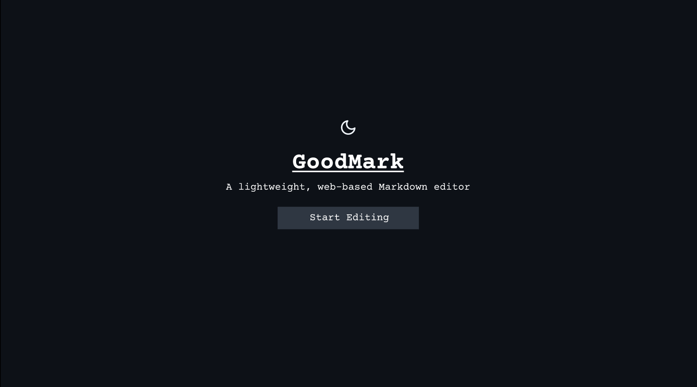
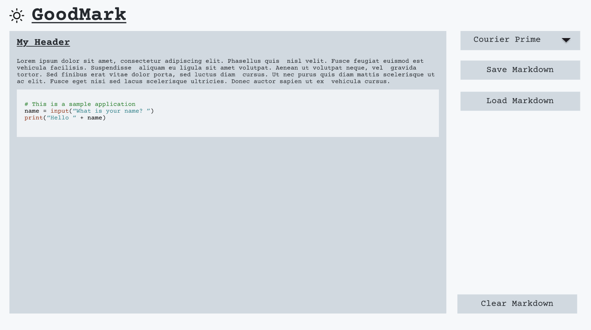

# GoodMark

A simple web-tool to preview and edit markdown.

## Project Summary

The purpose for this project is to create an easy to use lightweight Markdown previewing tool. This will allow users to edit and preview Markdown syntax in real-time, aiding those unfamiliar with markdown in proper use, and helping those familiar with markdown get the most out of it. The tool will simply the Markdown working process to ensure that it is accessible for all.

### Project Description

GoodMark is a web-based application designed to simplify the Markdown writing process by transforming plain-text Markdown into rendered HTML in real-time. It will be a good utility for both those who want to experiment with how they might use Markdown and seasoned Markdown users hoping to use a light-weight Markdown tool that renders in real time without needing a full editor installed.

Key features:
1. A real-time preview that dynamically updates as users type Markdown.
2. Syntax highlighting in code snippets.
3. A clean simple User Interface, see [User Interface Design](#user-interface) for more details.
4. Both dark and light mode to suit your preferences.

## Design

There are several stages to designing what this project will look like and how the project will be built. In order to gain a vision of what I am creating I started with the User Interface design. I then went on to design the architecture of the Software and designed how I will go about implementing the Software.

### User Interface

The user interface design was created in Figma. The prototype for this design is available [here](https://www.figma.com/proto/Bkpb34iogKXZpO8ttmP5ef/GoodMark?node-id=1-5&p=f&t=YSk4zt3abM4z9aqy-1&scaling=contain&content-scaling=fixed&page-id=0%3A1&starting-point-node-id=1%3A5&show-proto-sidebar=1).

#### Product Design

##### GoodMark Welcome Screen

When the user first opens the website, they should be greeted with a splash screen that will give them a brief overview of what the product is. This is similar to how many applications design their software. We see this significantly in video game design, where you would typically be presented with a game menu before being placed into the game. I felt that this was a good approach for this project as it would not overwhelm newer users with an immediate editing screen, and make them feel that they have a choice before entering the editor. I plan to use a cookie on the user's browser to track if they have visited the site and pressed the "Start Editing" button before, if they have, they will not be presented with the screen again unless they clear their cookies; this will avoid regular users having to continuously press the "Start Editing" button, whilst still giving newer users this choice splash screen. The user will also be able to select whether they wish to use light or dark mode on this screen, this will similarly be saved into a cookie on their browser - dark mode will be the default.

##### Editor Screen

Once the user selects the "Start Editing" button, or if they have visited the website before and have the cookie stored in their browser, they will be taken to the main Markdown editing screen. This screen will initially have some sample text if they have not edited before, if they have edited before, the last text they wrote will be populated into the textbox, similarly, stored in a cookie. The sample text will feature a heading, some normal text, and a code block to give the user an idea of the different Markdown options available to them. They will also have several options including a combo-box which will allow them to select a font from a pre-defined list, a "Save Markdown" button, allowing them to save a file to their machine containing their Markdown, and a "Load Markdown" button, allowing them to load any Markdown file from their machine into the text box. In the bottom right, there is a "Clear Markdown" button, this will allow the user to quickly clear their Markdown currently present, however, to avoid any accidental data losses it will prompt for confirmation first. Similarly to the welcome screen, they can also select light or dark mode on this screen with the icon in the top left.

###### Dark Mode

###### Light Mode

##### Colour Scheme

Perhaps the most widely distributed use of Markdown on the internet is on GitHub, as such, I felt that using [GitHub's colour scheme](https://primer.style/foundations/color/base-scales) would be appropriate to allow the user to preview the Markdown in the context that it will likely be distributed, in the form of a README similar to this file. I also feel that GitHub's neutral colour scheme is appropriate for this project as it will not be overstimulating whilst the user is attempting to write their Markdown. Bright flashy colours may distract the user. I also decided that dark mode would be the best as our default colour scheme as it avoids any accidental issues with bright light, for example, if someone's eyes were adjusted to the dark, a bright light will ruin that adjustment, whereas, if someone's eyes are adjusted for the light, a dark screen will minimally change that, if at all.

#### Accessibility

As discussed above, GitHub's colour scheme will have already been tested for accessibility, however, I ran some basic colour blindness simulations, using [Coblis](https://www.color-blindness.com/coblis-color-blindness-simulator/) to ensure that the UI was appropriate for users with colour blindness, the results of these are available [here](assets/readme-images/colour-blindness-simulations). Other important accessibility considerations that will be required in the implementation are keyboard navigation, to ensure that individuals navigating without a mouse can easily navigate the tool, this will primarily involve ensuring that the "Start Editing" button can be pressed without a mouse, and that the font selection, "Load Markdown" and "Save Markdown", and "Clear Markdown" buttons can be pressed, and that the user can easily return to the editor box. Further important accessibility testing will be to ensure that screen readers are able to correctly read the markdown editing box. Due to the scope and resourcing of this project, languages will not be accounted for, however, this would typically be an important accessibility consideration for a project - in this case, the site will be available in English only. We should also consider individuals devices, as such, responsive design will be important; editing Markdown on a phone is not ideal, but we should allow a user to do this if we wish and scale the page as appropriate, similarly, we need to account for both large and small desktop monitors to ensure that users in all ranges can use the site. There will be no animations on this site, as such, there is no need to consider this, however, we will add a timeout to the dark mode and light mode switcher to avoid any accidental mass-activations which could trigger photosensitivity.

### Software

### Implementation Approach

## Planning

### User Stories

### Roadmap

### MoSCoW Prioritisation

### Project Management

#### Issues, Epics and Stories

#### Labels

#### Sizing

#### Sprints

#### GitHub Projects

### Risks

## Documentation

### User

### Technical

## Evaluation